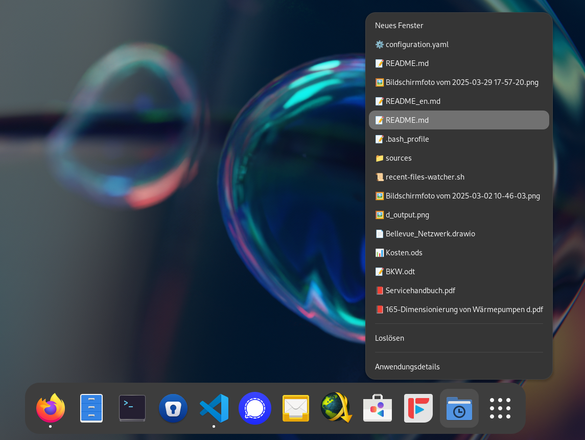

> ⚠️ This project was generated 100% with the help of a large language model (LLM).  
> However, the idea, concept, and implementation approach are original and authored by the user.  
> The LLM was used as a tool – not as an intelligent entity.

# 📁 recent-files-watcher.sh

A shell script that automatically creates and maintains a GNOME context menu with your recently used files – complete with emojis and a custom icon.



## 🔧 Features

- Reads recently used files from `recently-used.xbel`
- Creates a custom `.desktop` menu with up to 15 entries
- Assigns an appropriate emoji based on file type
- Automatically updates the menu when changes are detected
- Generates an embedded SVG icon

## ▶️ Usage

```bash
chmod +x recent-files-watcher.sh
```

To enable automatic startup, add the following line at the end of your `~/.bash_profile` (or `~/.bashrc`, depending on your system):

```bash
~/.local/bin/recent-files-watcher.sh &
```

💡 Make sure the script is saved in a proper location (e.g., `~/.local/bin`) and is in your PATH – or provide the full path.

## 📦 Installation Paths

- `.desktop`: `~/.local/share/applications/recent-files.desktop`

## ✅ Requirements

- `xdg-mime`, `xdg-open`
- GNOME-compatible desktop environment
- `awk`, `stat`, `sort`, `bash`

## 📌 Note

The menu appears in the GNOME Activities overview and provides quick access to your most recently opened files – complete with emojis based on MIME type.

---

✨ Enjoy!
